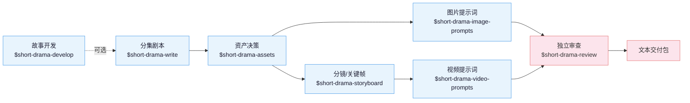

**中文** | [English](README_EN.md)

# 短剧技能套件

AI 短剧创作技能套件，覆盖故事开发、分集剧本、资产设定、分镜、图片与视频提示词，
以及独立审查。适配 Claude Code、Codex 和其他支持 Agent Skill 规范的运行环境。

它只生产文本：剧本、资产决策、图片提示词、分镜/关键帧提示词、视频提示词和
审查记录，位于媒体制作之前；本身**不生成图片、视频或音频，也不调用
任何媒体生成服务**。

## 核心思路

三句话贯穿整条制作链：

> 1. **剧本交付可表演、可制作的事实**：优先用行动、证据、调度与对白策略承载
>    意义；VO/OS、屏显文字和表演括注只在创作者有意选择时使用。
> 2. **资产拥有身份与状态，分镜拥有本镜呈现**：参考图版式、背景和视图数量由
>    项目用途决定，不把某一种白底三视图当成通用定律。
> 3. **连续性必须明确记录**：精确比较相邻镜头的已确认边界；提示词只重复当前执行
>    必需的局部锚点，不靠模型记忆，也不靠逐字堆满整份状态。

除此之外，规则分为四类：可以直接检查的结构要求、需要结合证据判断的内容要求、
通常有帮助的做法，以及由创作者决定的风格选择。这样不会把一种常用写法误当成硬规定。

## 生产链路



`$short-drama` 是入口路由：初始化、继续、恢复和交付项目，把具体工作转给对应
技能。现成剧本可以直接进入规范化或资产拆解，不必补造开发文件。

## 技能

| 技能 | 职责 |
|---|---|
| `short-drama` | 初始化、路由、状态、异常恢复、接受/审查生命周期与交付 |
| `short-drama-develop` | 故事承诺、故事引擎、分集地图、导演阐述、题材与钩子手册 |
| `short-drama-write` | 单集目标、因果节拍、可拍剧本和项目选择的制作稿格式 |
| `short-drama-assets` | 人物/造型、地点/视图、道具/状态与连续性决策 |
| `short-drama-image-prompts` | 角色、场景、道具参考板提示词与定点修改说明 |
| `short-drama-storyboard` | 原文落实、镜头目的、场面调度、连续性边界和冻结关键帧 |
| `short-drama-video-prompts` | 单镜头内的动作、表演、摄影、声音、起止状态与补拍说明 |
| `short-drama-review` | 结构校验、带证据的内容审查、制作质量检查与独立审查结论 |

## 安装

**方式一** 直接告诉 Claude Code、Codex 等支持导入 GitHub 仓库的智能体：

```
安装这个技能套件 https://github.com/worldwonderer/drama-skills
```

**方式二** 手动链接（八个技能目录必须保持同级）：

```bash
git clone https://github.com/worldwonderer/drama-skills.git && cd drama-skills

# Claude Code
mkdir -p "$HOME/.claude/skills"
for skill in skills/*; do
  ln -s "$PWD/$skill" "$HOME/.claude/skills/$(basename "$skill")"
done

# Codex
mkdir -p "${CODEX_HOME:-$HOME/.codex}/skills"
for skill in skills/*; do
  ln -s "$PWD/$skill" "${CODEX_HOME:-$HOME/.codex}/skills/$(basename "$skill")"
done
```

已存在同名技能时先移除旧链接，不要混装版本。安装后从 `$short-drama` 开始；
具体任务也可以直接调用对应技能。

## 快速开始

```
# 1. 新建项目
用 $short-drama 初始化一个都市打脸题材的短剧项目，竖屏 9:16

# 2. 写第一集（检查人物选择、局部结果与集间交接；不硬套固定拍数/反转公式）
用 $short-drama-write 写第 1 集：外卖员在高档餐厅被经理羞辱，亮出集团董事身份

# 3. 拆资产、出分镜、出视频提示词
用 $short-drama-assets 从第 1 集拆人物/场景/道具
用 $short-drama-storyboard 给第 1 集做分镜
用 $short-drama-video-prompts 把分镜逐镜翻译成视频提示词

# 4. 独立审查
用 $short-drama-review 审查第 1 集的剧本与提示词
```

完整成品示例见 [demo/](demo/)：一集剧本 → 资产设定 → 分镜 → 视频提示词的
全链路产出。

## 验证与开发

```bash
PYTHONDONTWRITEBYTECODE=1 python3 -B -m unittest discover -s tests -v
ruff check --no-cache .
python3 tools/verify_suite.py skills/short-drama
```

仓库维护工具不随技能安装。改动 `skills/` 下任何文件后，在仓库根目录重建套件清单：
`python3 tools/update_suite_manifest.py skills/short-drama`。
贡献约定见 [CONTRIBUTING.md](CONTRIBUTING.md)。

## 许可证

MIT — 见 [LICENSE](LICENSE)。
