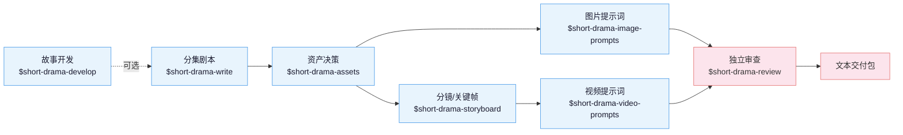

**中文** | [English](README_EN.md)

# Drama Skills

AI 短剧创作 skill 套件，覆盖从故事开发、分集剧本、资产设定、分镜、图片/视频提示词
到独立审查的完整文本生产链路。适配 Claude Code、Codex 及其他支持 Agent Skills
的运行时。

它只生产文本：剧本、资产决策、图片提示词、分镜/关键帧提示词、视频提示词和
审查记录，站在整条生成管线的最上游；本身**不生成图片、视频或音频，也不调用
任何媒体生成服务**。

## 核心思路

三句话贯穿整条制作链：

> 1. **剧本是拍摄指令**：每行都要回答"摄影机拍什么"，心理走 OS、设定走
>    字幕/VO、情绪走表演括注。
> 2. **资产写不变量，分镜写变量**：角色的长相和服装在纯白底定妆图里锁死，
>    光影、构图、情绪则逐镜设计。
> 3. **连续性是显式工程**：上一镜的结束状态要逐字写进下一镜的开始状态，
>    别指望模型自己记得。

三句话之上，还有**四级规则分级**（结构不变量 / 审查不变量 / 工艺默认 / 品味
选项），把要求分成必须机器校验、需要证据审查、创作者说了算三类。

## 生产链路



`$short-drama` 是入口路由：初始化、继续、恢复和交付项目，把具体工作转给对应
skill。现成剧本可以直接进入规范化或资产拆解，不必补造开发文件。

## Skills

| Skill | 职责 |
|---|---|
| `short-drama` | 初始化、路由、状态、异常恢复、接受/审查生命周期与交付 |
| `short-drama-develop` | 故事承诺、故事引擎、分集地图、导演阐述、题材与钩子手册 |
| `short-drama-write` | 单集契约、因果节拍、可拍剧本；生产方言（△/▲、OS/VO、系统流语法） |
| `short-drama-assets` | 人物/造型、地点/视图、道具/状态与连续性决策 |
| `short-drama-image-prompts` | 角色三视图、场景方位图、物品白底图与定点修改指令 |
| `short-drama-storyboard` | 拍→镜翻译、五连接词时序链、运镜决策表、冻结关键帧 |
| `short-drama-video-prompts` | 状态接续四元组、角色状态追踪、负面约束体系、情绪弧线 |
| `short-drama-review` | 结构校验、证据化审查、生产质量门与独立 verdict |

## 安装

**方式一** 直接告诉 Claude Code / Codex 等支持导入 GitHub 仓库的 Agent：

```
安装这个 skill 套件 https://github.com/worldwonderer/drama-skills
```

**方式二** 手动链接（八个目录必须保持 sibling 布局）：

```bash
git clone https://github.com/worldwonderer/drama-skills.git && cd drama-skills

# Claude Code
mkdir -p "$HOME/.claude/skills"
for skill in skills/*; do
  ln -s "$PWD/$skill" "$HOME/.claude/skills/$(basename "$skill")"
done

# Codex
mkdir -p "${CODEX_HOME:-$HOME/.codex}/skills"
for skill in skills/*; do
  ln -s "$PWD/$skill" "${CODEX_HOME:-$HOME/.codex}/skills/$(basename "$skill")"
done
```

已存在同名 skill 时先移除旧链接，不要混装版本。安装后从 `$short-drama` 开始；
具体任务也可以直接调用对应 skill。

## 快速开始

```
# 1. 新建项目
用 $short-drama 初始化一个都市打脸题材的短剧项目，竖屏 9:16

# 2. 写第一集（检查人物选择、局部结果与集间交接；不硬套固定拍数/反转公式）
用 $short-drama-write 写第 1 集：外卖员在高档餐厅被经理羞辱，亮出集团董事身份

# 3. 拆资产、出分镜、出视频提示词
用 $short-drama-assets 从第 1 集拆人物/场景/道具
用 $short-drama-storyboard 给第 1 集做分镜
用 $short-drama-video-prompts 把分镜翻译成 15s 分镜组提示词

# 4. 独立审查
用 $short-drama-review 审查第 1 集的剧本与提示词
```

完整成品示例见 [demo/](demo/)：一集剧本 → 资产设定 → 分镜 → 视频提示词的
全链路产出。

## 验证与开发

```bash
PYTHONDONTWRITEBYTECODE=1 python3 -B -m unittest discover -s tests -v
ruff check --no-cache .
python3 skills/short-drama/scripts/verify_suite.py
```

改动 `skills/` 下任何文件后重建套件清单：
`python3 skills/short-drama/scripts/update_suite_manifest.py`。
贡献约定见 [CONTRIBUTING.md](CONTRIBUTING.md)。

## License

MIT — 见 [LICENSE](LICENSE)。
