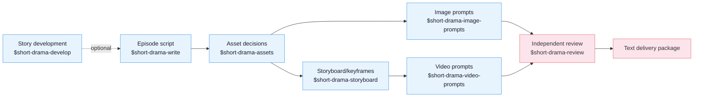

[中文](README.md) | **English**

# Drama Skills

An AI short-drama creation skill suite covering the full text production chain:
story development, episode scripts, asset sheets, storyboards, image/video
prompts, and independent review. Works with Claude Code, Codex, and any other
runtime that supports Agent Skills.

This repository only produces text: screenplays, asset decisions, image prompts,
storyboard/keyframe prompts, video prompts, and review records. It sits at the
very top of the generation pipeline; it **generates no images, video, or audio
and calls no media-generation services**.

## Core ideas

Three principles run through the whole chain:

> 1. **A script is a shooting instruction.** Every line must answer "what does
>    the camera shoot": psychology goes to OS, worldbuilding to captions/VO,
>    emotion to performance cues.
> 2. **Assets fix the invariants, storyboards design the variables.** A
>    character's face and wardrobe are locked in a pure-white-background model
>    sheet; light, composition, and emotion are designed shot by shot.
> 3. **Continuity is explicit engineering.** The previous shot's end state is
>    written verbatim into the next shot's start state; don't count on the model
>    to remember.

Above those three sits a **four-tier rule system** (structural invariant /
reviewed invariant / craft default / taste option) that splits requirements into
what machines must verify, what reviewers must back with evidence, and what stays
the creator's call.

## Production chain



`$short-drama` is the entry router: it initializes, resumes, recovers, and
delivers projects, dispatching the actual work to the matching skill. An
existing screenplay can enter normalization or asset extraction directly.

## Skills

| Skill | Responsibility |
|---|---|
| `short-drama` | Init, routing, state, recovery, acceptance/review lifecycle, delivery |
| `short-drama-develop` | Story promise, story engine, episode map, director brief, genre & hook playbook |
| `short-drama-write` | Episode contract, causal beats, shootable screenplay; production dialect (△/▲, OS/VO, system-genre syntax) |
| `short-drama-assets` | Character/Look, Location/View, Prop/State, continuity decisions |
| `short-drama-image-prompts` | Character turnaround sheets, directional scene plates, prop white-background shots, pinpoint edit prompts |
| `short-drama-storyboard` | Beat-to-shot translation, five-connective time chains, camera-move decision table, frozen keyframes |
| `short-drama-video-prompts` | State-continuation quads, character state tracking, negative-constraint system, emotion arcs |
| `short-drama-review` | Structural validation, evidence-based review, production quality gates, independent verdicts |

## Install

**Option 1** — just tell Claude Code / Codex or any agent that can import a
GitHub repository:

```
Install this skill suite: https://github.com/worldwonderer/drama-skills
```

**Option 2** — manual linking (the eight directories must stay siblings):

```bash
git clone https://github.com/worldwonderer/drama-skills.git && cd drama-skills

# Claude Code
mkdir -p "$HOME/.claude/skills"
for skill in skills/*; do
  ln -s "$PWD/$skill" "$HOME/.claude/skills/$(basename "$skill")"
done

# Codex
mkdir -p "${CODEX_HOME:-$HOME/.codex}/skills"
for skill in skills/*; do
  ln -s "$PWD/$skill" "${CODEX_HOME:-$HOME/.codex}/skills/$(basename "$skill")"
done
```

Remove any same-named skill links first — do not mix versions. Start from
`$short-drama`; specific tasks can also invoke the matching skill directly.

## Quick start

```
# 1. New project
Use $short-drama to init a vertical 9:16 urban face-slapping short-drama project

# 2. Write episode 1 (check character choice, local result, and exact handoff;
#    do not impose fixed beat or reversal formulas)
Use $short-drama-write to write EP1: a delivery rider humiliated at a luxury
hotel turns out to be the group chairman

# 3. Assets, storyboard, video prompts
Use $short-drama-assets to extract characters/scenes/props from EP1
Use $short-drama-storyboard to storyboard EP1
Use $short-drama-video-prompts to translate the storyboard into 15s shot-group prompts

# 4. Independent review
Use $short-drama-review to review EP1's script and prompts
```

See [demo/](demo/) for a complete worked example: one episode's script → asset
sheets → storyboard → video prompts.

## Verify & develop

```bash
PYTHONDONTWRITEBYTECODE=1 python3 -B -m unittest discover -s tests -v
ruff check --no-cache .
python3 skills/short-drama/scripts/verify_suite.py
```

After changing anything under `skills/`, rebuild the suite manifest:
`python3 skills/short-drama/scripts/update_suite_manifest.py`.
See [CONTRIBUTING.md](CONTRIBUTING.md) for conventions.

## License

MIT — see [LICENSE](LICENSE).
